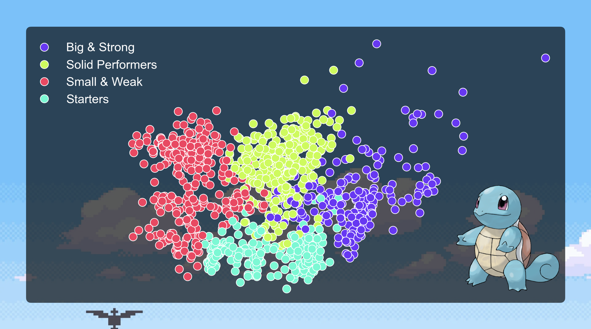
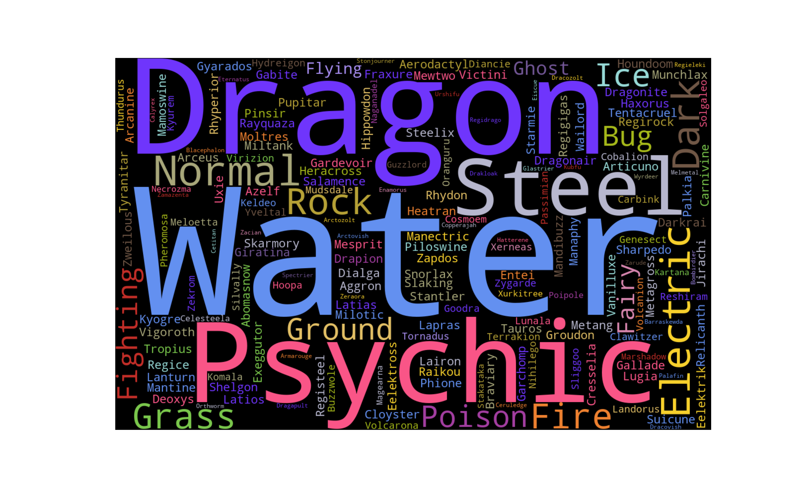
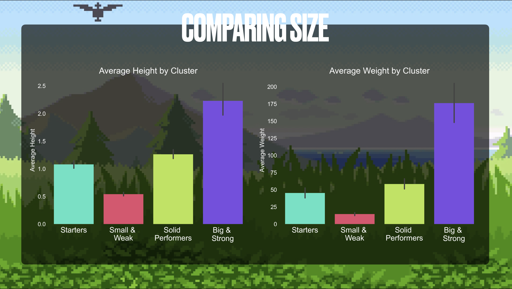
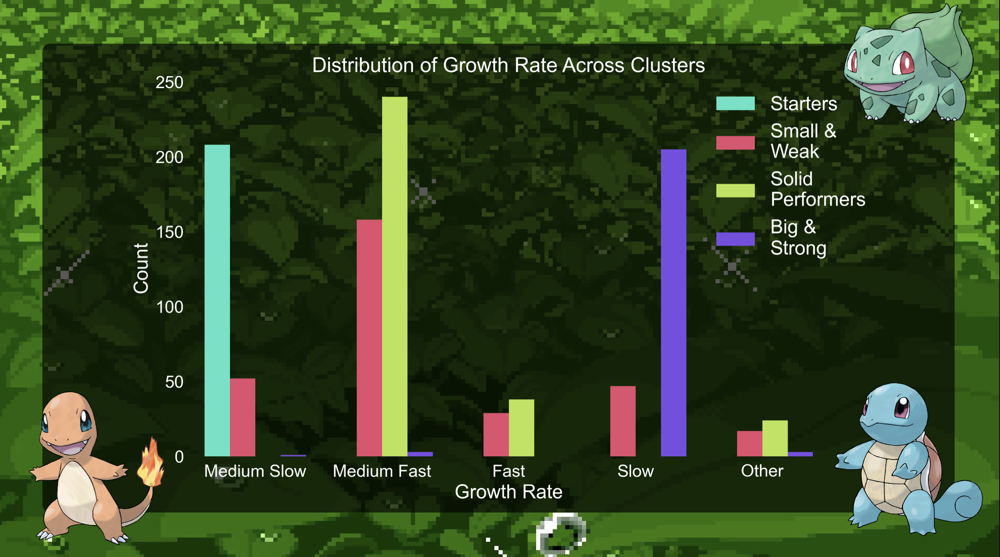
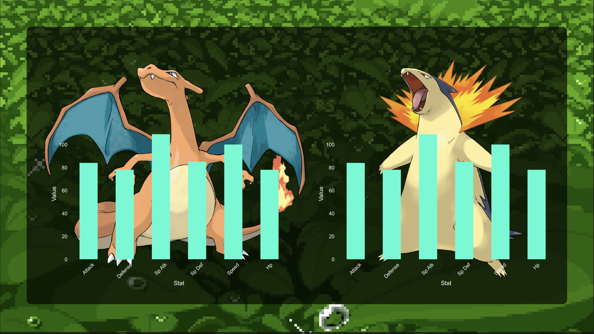

# Pokémon Categorization Using Machine Learning

This repository provides a comprehensive analysis of Pokémon categorization using machine learning techniques. The focus is on clustering Pokémon based on various attributes, visualizing the results, and performing additional statistical analysis to understand the characteristics of each cluster.

## Table of Contents
1. [Introduction](#introduction)
2. [Data Preparation](#data-preparation)
3. [Feature Selection](#feature-selection)
4. [Clustering Analysis](#clustering-analysis)
5. [Cluster Visualization](#cluster-visualization)
6. [Statistical Analysis](#statistical-analysis)
7. [Additional Visualizations](#additional-visualizations)
8. [Usage](#usage)
9. [Dependencies](#dependencies)

## Introduction
This project aims to categorize Pokémon into clusters using machine learning techniques. The main objective is to explore how Pokémon can be grouped based on attributes like height, weight, base stats, and type, and to visualize the characteristics and differences between these clusters.

## Data Preparation
- **Dataset:** The dataset includes various attributes for each Pokémon, such as height, weight, base stats (HP, Attack, Defense, Special Attack, Special Defense, Speed), catch rate, type (primary and secondary), and growth rate.
- **Preprocessing Steps:**
  - **Data Cleaning:** Removed or imputed missing values, handled anomalies.
  - **Feature Standardization:** Standardized numerical features to ensure comparability.
  - **Categorical Encoding:** Encoded categorical variables (e.g., Pokémon types) using one-hot encoding to make them suitable for machine learning algorithms.

## Feature Selection
Key features were selected based on their relevance to clustering:
- **Numerical Features:** Height, weight, base stats (HP, Attack, Defense, etc.).
- **Categorical Features:** Pokémon type (primary and secondary), growth rate.
- **Dimensionality Reduction:** Techniques like Principal Component Analysis (PCA) were used to reduce the dimensionality of the feature space while retaining significant information.

## Clustering Analysis
- **Algorithm Used:** K-Means clustering was employed to segment Pokémon into distinct clusters.
  - **Number of Clusters:** Four clusters were determined based on the elbow method and silhouette scores.
  - **Cluster Descriptions:**
    - **Cluster 0:** Includes all the starter Pokémon and generally has balanced stats.
    - **Cluster 1:** Smaller and less powerful Pokémon.
    - **Cluster 2:** Pokémon with moderate performance.
    - **Cluster 3:** Powerful and rare Pokémon with high stats.

## Cluster Visualization

### Word Clouds
- **Purpose:** Generate word clouds for each cluster to visually represent the types of Pokémon within each cluster.
- **Custom Color Palette:** Each Pokémon type is assigned a specific color to highlight type distributions.

### Statistical Analysis
- **T-Tests:** Conducted pairwise t-tests to compare the mean height and weight between Cluster 3 and other clusters, adjusting for multiple comparisons using Bonferroni correction.
- **Dual-Type Proportions:** Calculated the proportion of dual-type Pokémon in each cluster to understand the prevalence of Pokémon with two types.

## Additional Visualizations

### Attribute Bar Charts
- **Purpose:** Display the average values of height, weight, and total stats for each cluster to provide a clear comparison of these attributes.
- **Customization:** Bar charts are color-coded according to clusters and saved as high-resolution PNG images.

### Growth Rate Distribution
- **Purpose:** Visualize the distribution of growth rate categories across clusters using a count plot.
- **Color Mapping:** Different colors represent various growth rate categories to illustrate their prevalence in each cluster.

### Individual Pokémon Stats
- **Functionality:** Plot individual Pokémon stats (e.g., Attack, Defense) to provide a detailed view of specific Pokémon characteristics.
- **Example:** Detailed stats for Pokémon like Typhlosion and Charizard are plotted for comparison, pointing out that they do in fact have the exact same stats.

## Usage

 - Clone the repository:
   
 - git clone https://github.com/getfader/Machine_Learning_Pokemon.git
   
 - cd machine_learning_pokemon

## Dependencies

- **Python 3.x**
- **Pandas**: For data manipulation and analysis.
- **NumPy**: For numerical operations.
- **Scikit-learn**: For machine learning algorithms and preprocessing.
- **Seaborn**: For statistical data visualization.
- **Matplotlib**: For creating static, animated, and interactive visualizations.
- **WordCloud**: For generating word clouds.
- **SciPy**: For statistical tests.

